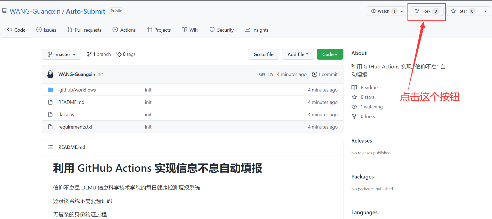
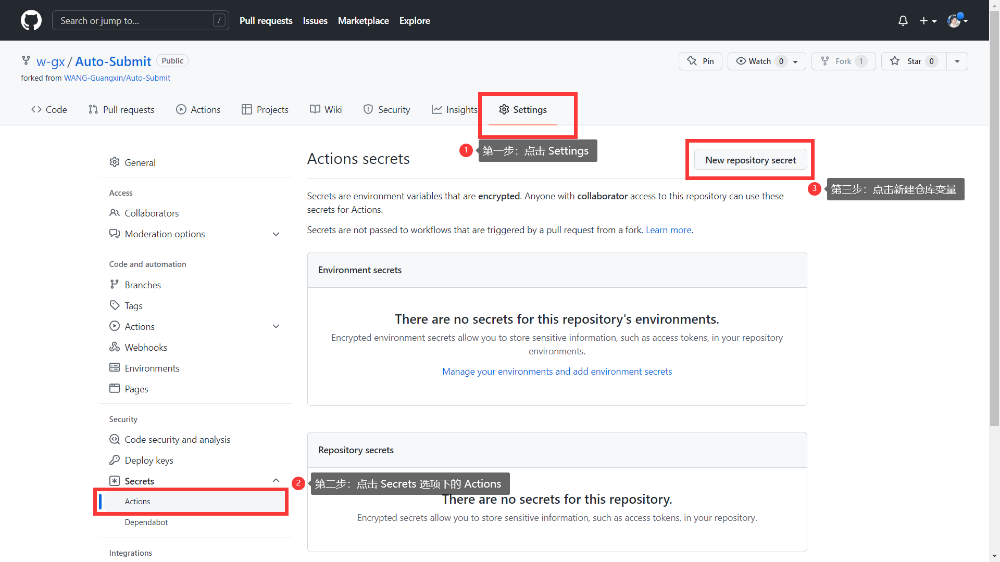
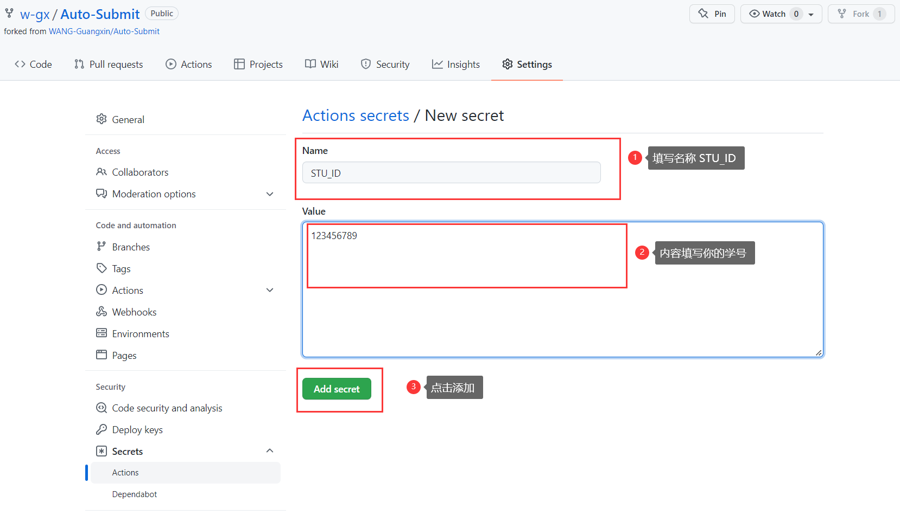
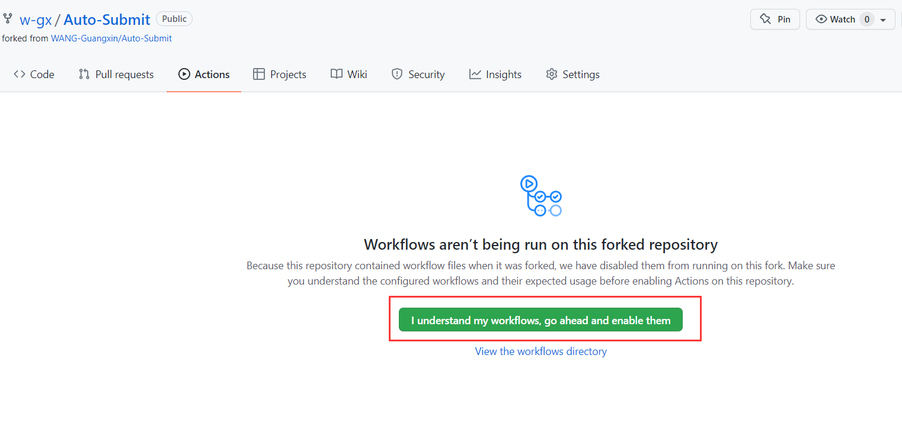
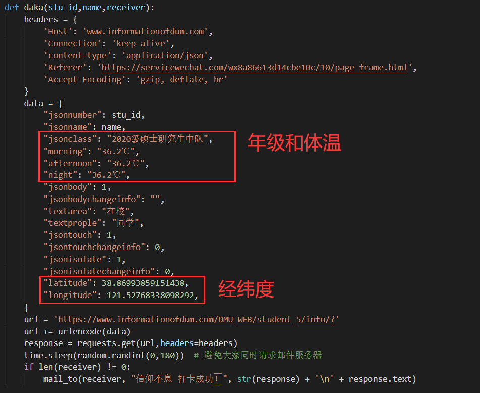
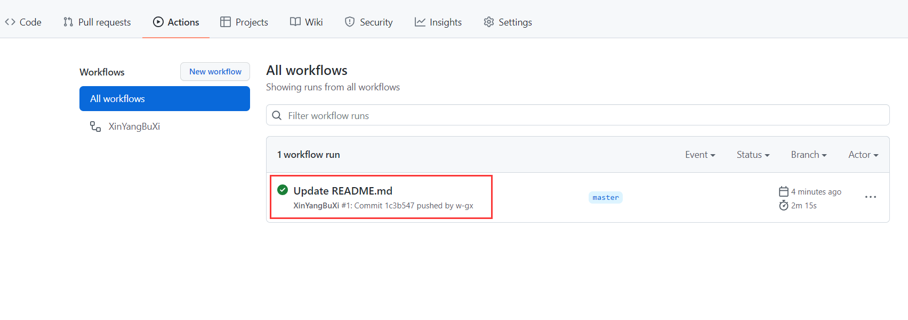
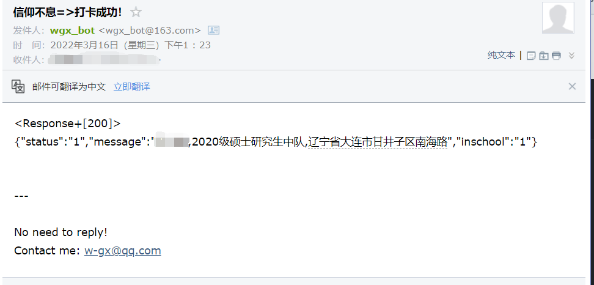

# 利用 GitHub Actions 实现信息不息自动填报

信仰不息是 DLMU 信息科学技术学院的每日健康检测填报系统

登录该系统不需要验证码

无复杂的身份验证过程

信息填报只需一个 Get 请求即可

由于许多小伙伴没有服务器，无法利用定时任务来实现自动填报

因此本项目介绍如何利用 GitHub Actions 定时执行填报脚本

# Fork本项目

如果你还没有 GitHub 账号，请先注册

登录成功后，点击本仓库的 Fork 按钮

# 添加环境变量

需要添加以下环境变量：

1. STU_ID：填写你的学号
2. NAME：填写你的姓名
3. RECEIVER：邮箱（可选，用于提醒你打卡结果）

添加环境变量的过程是：

# 启用 Actions

# 修改 daka.py 文件

主要修改年级信息和位置信息

其中位置信息用经纬度来体现

修改提交后 Actions 开始运行

3 分钟内运行完毕，可以看到绿色对勾，并收到邮件提醒（如果配置了相应环境变量的话）

